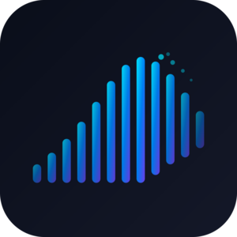

<p align="center">
  
</p>

<h1 align="center">Tid3</h1>

<p align="center">
  A native Windows desktop client for TIDAL, built with WinUI 3 and Fluent Design.
</p>

<p align="center">
  <a href="https://github.com/ArthurCarrenho/tid3/releases/latest">
    
  </a>
  <a href="https://github.com/ArthurCarrenho/tid3/actions/workflows/release.yml">
    
  </a>
  
  
  <a href="LICENSE">
    
  </a>
</p>

<p align="center">
  Hi-Res Lossless · Synced Lyrics · Cloud Sync · Discord RPC · Last.fm
</p>

---

> **Unofficial project.** Tid3 has no affiliation with TIDAL Music AS. It uses TIDAL's internal API for personal use. A paid TIDAL subscription is required.

---

## Table of Contents

- [Screenshots](#screenshots)
- [Features](#features)
- [Installation](#installation)
  - [Pre-built release](#pre-built-release)
  - [Build from source](#build-from-source)
- [Cloud Sync](#cloud-sync)
- [Localization](#localization)
- [Roadmap](#roadmap)
- [Contributing](#contributing)
- [License](#license)

---

## Screenshots

<p align="center">
  
  
</p>
<p align="center">
  
  
</p>
<p align="center">
  
</p>

---

## Features

**Playback**
- Hi-Res Lossless (MAX), Lossless (HIGH), and Dolby Atmos quality
- Gapless playback
- SMTC integration — media keys, taskbar thumbnail controls, lock screen

**Browsing**
- Personalized home feed
- Search across tracks, albums, artists, and playlists
- Artist pages with biography, top tracks, and full discography
- Album, playlist, and mix detail views

**Library**
- Liked songs, saved albums, and playlists
- Like/unlike tracks from the playback bar

**Queue & Lyrics**
- Queue panel with shuffle and repeat modes
- Real-time synced lyrics with word-by-word highlight

**Integrations**
- **Cloud Sync** — sync queue and playback state across devices via a self-hosted Cloudflare Worker
- **Last.fm** — automatic scrobbling
- **Discord Rich Presence** — show what you're listening to

**System**
- System tray with mini controls
- Launch at startup
- Dark / Light / System theme
- English and Portuguese (Brazil) UI

---

## Installation

### Pre-built release

Download the latest `.msix` from the [Releases](https://github.com/ArthurCarrenho/tid3/releases/latest) page.

Because Tid3 is sideloaded (not from the Microsoft Store), you need to trust the signing certificate before installing:

1. Right-click the `.msix` file → **Properties** → **Digital Signatures**
2. Select the signature → **Details** → **View Certificate** → **Install Certificate**
3. Choose **Local Machine** → **Place all certificates in the following store** → **Trusted People**
4. Finish, then double-click the `.msix` to install

Or install directly from PowerShell:
```powershell
Add-AppxPackage -Path .\Tid3_x64.msix
```

> **Note:** Three packages are provided per release — `x64`, `x86`, and `arm64`. Install the one that matches your machine.

### Build from source

**Prerequisites**
- Windows 10 version 2004 (build 19041) or later
- [Visual Studio 2022](https://visualstudio.microsoft.com/) with the **Windows App SDK** workload
- [.NET 8.0 SDK](https://dotnet.microsoft.com/download)

```bash
git clone https://github.com/ArthurCarrenho/tid3.git
cd tid3
```

Open `TidalUi3.sln` in Visual Studio 2022, set the target platform to **x64**, and press **F5**.

---

## Cloud Sync

Tid3 can sync playback state in real time across multiple devices using an open WebSocket protocol. The reference server is a free Cloudflare Worker and there is also a Go terminal client — but any device that implements the protocol can participate.

| | |
|---|---|
| [Cloud Sync Protocol](docs/cloud-sync-protocol.md) | Message format, data structures, implementation guide |
| [Cloudflare Worker](docs/cloudflare-worker.md) | Reference server — deploy instructions and architecture |
| [Go Terminal Client](docs/go-terminal-client.md) | Reference client — setup, commands, protocol behaviour |

**Quick start:**

```bash
cd docs/examples/sync-worker
npm install
npx wrangler deploy
```

Then go to **Settings → Integrations → Cloud Sync**, enable it, and set the server URL to `wss://your-worker.workers.dev/sync`.

---

## Localization

UI strings live in `Strings/en-US/Resources.resw` and `Strings/pt-BR/Resources.resw`. To add a new language, copy either file into `Strings/<locale>/` and translate the values. Open a PR and it will be included in the next release.

## Contributing

Pull requests are welcome. For larger changes, please open an issue first to discuss what you'd like to change.

Code conventions:
- PascalCase for types and methods, `_camelCase` for private fields
- File-scoped namespaces, nullable reference types enabled — no `!` suppressions without justification
- XAML event handlers named `ControlName_EventName`
- All UI updates must go through `DispatcherQueue.TryEnqueue`

---

## License

Copyright © 2026 Arthur Carrenho. Released under the [GNU Affero General Public License v3.0](LICENSE).

Any modified version of this software — including one offered as a network service — must be released under the same terms.
