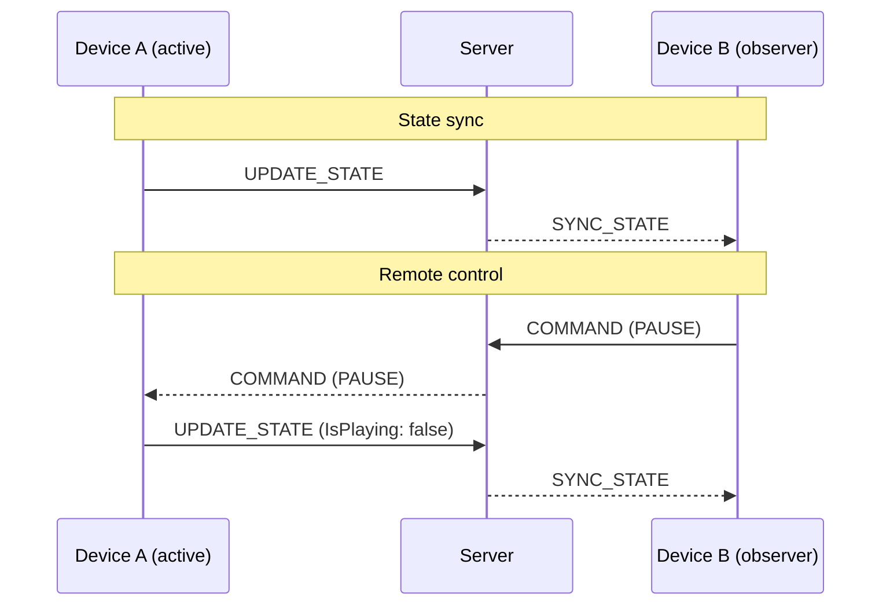
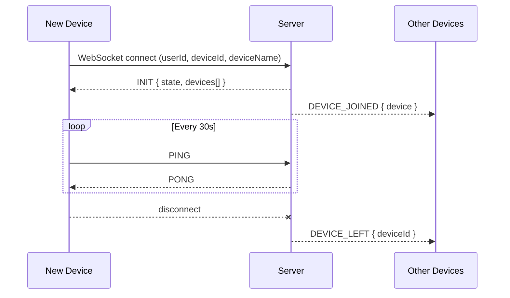
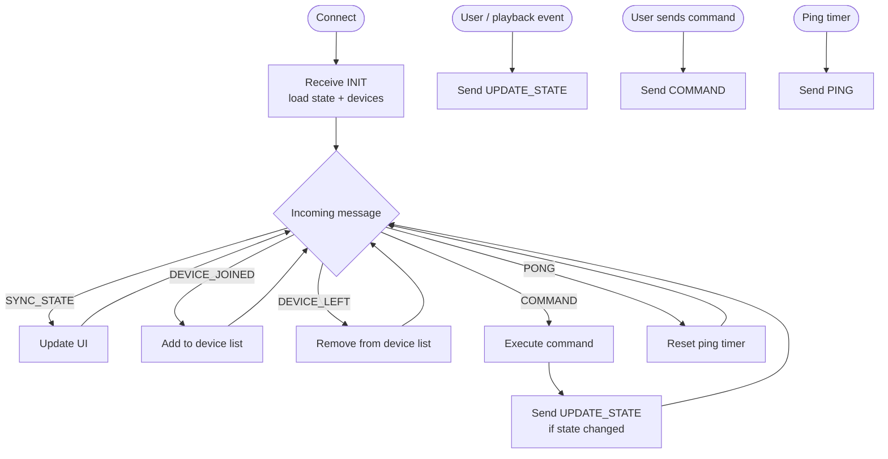

# Cloud Sync Protocol

Tid3's cloud sync is a lightweight WebSocket protocol for sharing playback state and sending remote commands across devices. The reference server ([Cloudflare Worker](cloudflare-worker.md)) and reference client ([Go terminal client](go-terminal-client.md)) are just two examples — any device that speaks this protocol can join the same session.

---

## How It Works

All devices for the same user share a single server-side session. The active playback device publishes its state; the server broadcasts it to every other device. Any device can also send commands to control playback on the active device, or transfer it entirely.



---

## Connecting

```
wss://<server>/sync?userId=<userId>&deviceId=<deviceId>&deviceName=<deviceName>
```

| Parameter    | Description |
|--------------|-------------|
| `userId`     | The user's TIDAL user ID. All devices with the same value share the same session. |
| `deviceId`   | A stable unique identifier for this device. Use a UUID and persist it between sessions. |
| `deviceName` | Human-readable label shown in device lists. Must be URL-encoded. |

On a successful connection the server immediately sends [`INIT`](#init).

### Connection flow



---

## Message Format

All messages are UTF-8 encoded JSON text frames. Every message has a `type` field.

```json
{ "type": "MESSAGE_TYPE", ... }
```

Multi-frame WebSocket messages must be reassembled before parsing.

---

## Server → Client Messages

### `INIT`

Sent immediately after connection. Contains the full device list and the last known state so the new device can catch up without waiting for the next `UPDATE_STATE`.

```json
{
  "type": "INIT",
  "state": <SyncState> | null,
  "devices": [ <DeviceInfo>, ... ]
}
```

`state` is `null` if no device has published state yet. `devices` includes the connecting device itself — filter by `deviceId` to exclude self.

---

### `SYNC_STATE`

Broadcast to all devices except the sender when any device sends `UPDATE_STATE`.

```json
{
  "type": "SYNC_STATE",
  "data": <SyncState>
}
```

---

### `DEVICE_JOINED`

Broadcast when a new device connects.

```json
{
  "type": "DEVICE_JOINED",
  "device": <DeviceInfo>
}
```

---

### `DEVICE_LEFT`

Broadcast when a device disconnects.

```json
{
  "type": "DEVICE_LEFT",
  "deviceId": "string"
}
```

---

### `COMMAND`

A command routed from one device to another (or all). See [Commands](#commands).

```json
{
  "type": "COMMAND",
  "data": <SyncCommand>
}
```

---

### `PONG`

Response to a `PING` keepalive.

```json
{ "type": "PONG" }
```

---

## Client → Server Messages

### `UPDATE_STATE`

Publishes the sender's current playback state. The server persists it and broadcasts it as `SYNC_STATE` to all other devices.

```json
{
  "type": "UPDATE_STATE",
  "data": <SyncState>
}
```

Send this on every meaningful state change: track change, play/pause, seek, volume adjustment, queue edit.

---

### `COMMAND`

Sends a playback command. The server routes it to the target device (or all devices if `TargetDeviceId` is empty).

```json
{
  "type": "COMMAND",
  "data": <SyncCommand>
}
```

---

### `PING`

Keepalive. Recommended interval: 30 seconds. The server responds with `PONG`.

```json
{ "type": "PING" }
```

---

## Data Structures

### `SyncState`

| Field              | Type               | Description |
|--------------------|--------------------|-------------|
| `Queue`            | `Track[]`          | Ordered list of tracks in the current queue |
| `CurrentIndex`     | `number`           | Index of the currently playing track, or `-1` |
| `PositionSeconds`  | `number`           | Current playback position in seconds |
| `DurationSeconds`  | `number`           | Duration of the current track in seconds |
| `Volume`           | `number`           | Volume level, `0.0`–`1.0` |
| `IsPlaying`        | `boolean`          | Whether audio is currently playing |
| `Shuffle`          | `boolean`          | Whether shuffle is active |
| `Repeat`           | `number`           | `0` = Off · `1` = All · `2` = One |
| `ActiveDeviceId`   | `string`           | `deviceId` of the device that owns this state |
| `ActiveDeviceName` | `string`           | Human-readable name of the active device |
| `LastUpdated`      | `string` (ISO 8601)| Timestamp of the last update |

### `Track`

| Field    | Type     | Description  |
|----------|----------|--------------|
| `Title`  | `string` | Track title  |
| `Artist` | `string` | Artist name  |

> The Tid3 `Track` model has additional fields (album, cover URL, IDs…). Implementations that don't need them can safely ignore unknown fields.

### `DeviceInfo`

| Field        | Type     | Description              |
|--------------|----------|--------------------------|
| `deviceId`   | `string` | Stable unique identifier |
| `deviceName` | `string` | Human-readable label     |

### `SyncCommand`

| Field            | Type     | Description |
|------------------|----------|-------------|
| `Type`           | `string` | One of the command types below |
| `Value`          | `string` | Optional parameter (see table) |
| `TargetDeviceId` | `string` | Target device, or `""` to broadcast to all |

---

## Commands

| `Type`     | `Value`                         | Description |
|------------|---------------------------------|-------------|
| `PLAY`     | —                               | Resume playback |
| `PAUSE`    | —                               | Pause playback |
| `NEXT`     | —                               | Skip to next track |
| `PREV`     | —                               | Go to previous track |
| `SEEK`     | Position in seconds (`"42.5"`)  | Seek to position |
| `VOLUME`   | Level `0.0`–`1.0` (`"0.75"`)   | Set volume |
| `TRANSFER` | —                               | Transfer active playback to `TargetDeviceId` |

---

## Session Rules

- All devices sharing the same `userId` are in the same session.
- State is persisted server-side between connections — a reconnecting device receives the last state via `INIT`.
- The server does not enforce which device is "active". Any device may call `UPDATE_STATE`. Passive clients (like a display or remote control) should not.
- **Avoid feedback loops:** never respond to an incoming `SYNC_STATE` or `INIT` by sending `UPDATE_STATE`. Check `ActiveDeviceId` and skip updates that originated from your own device.

---

## Implementing a Client



**Minimum requirements:**

1. Open a WebSocket with `userId`, `deviceId`, `deviceName`
2. Handle `INIT` — seed state and device list
3. Handle `SYNC_STATE` — update display
4. Handle `DEVICE_JOINED` / `DEVICE_LEFT` — maintain device list
5. Handle `COMMAND` — execute playback actions
6. Send `UPDATE_STATE` when local playback state changes *(active devices only)*
7. Send `PING` every ~30 seconds

See the reference implementations:
- [Cloudflare Worker](cloudflare-worker.md) — reference server
- [Go Terminal Client](go-terminal-client.md) — reference client
