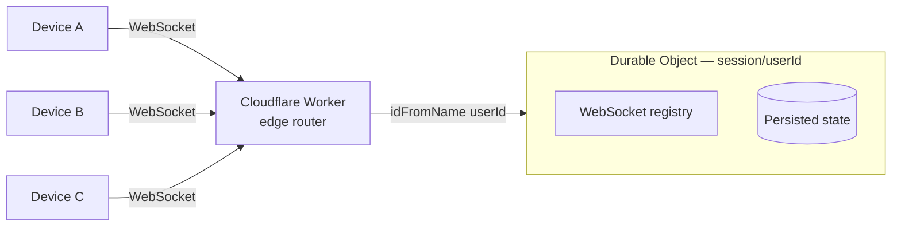
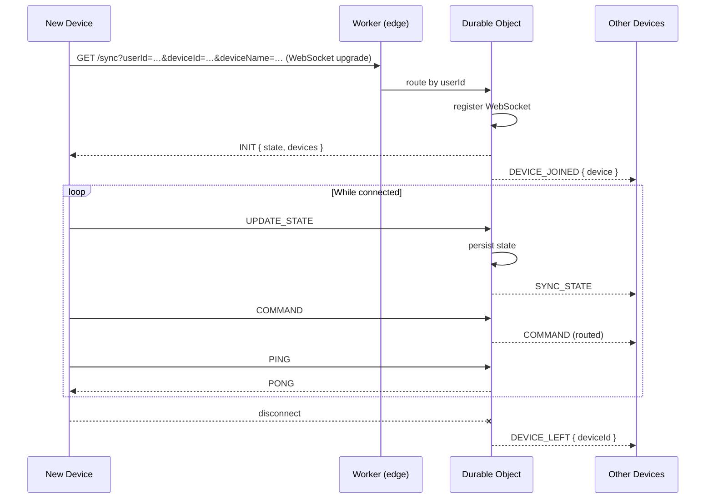

# Cloudflare Worker — Reference Server

The reference server for the [Cloud Sync Protocol](cloud-sync-protocol.md) is a [Cloudflare Worker](https://workers.cloudflare.com/) backed by [Durable Objects](https://developers.cloudflare.com/durable-objects/). Source lives in [`docs/examples/sync-worker/`](examples/sync-worker/).

This is one possible server implementation. Any server that speaks the protocol works — see [Writing Your Own Server](#writing-your-own-server).

---

## Architecture

Each user gets their own Durable Object instance. The Worker's job is just to route an incoming request to the right one based on `userId`. The Durable Object holds the WebSocket connections and persists the last state.



Because Cloudflare routes every request for a given `userId` to the same Durable Object — regardless of which edge node handles it — all devices for the same user are always in the same session.

---

## Session Lifecycle



State is persisted after every `UPDATE_STATE`, so a device that reconnects later will receive the last known state in `INIT`.

---

## Deploying

### Prerequisites

- A free [Cloudflare account](https://dash.cloudflare.com/sign-up)
- [Node.js](https://nodejs.org/) 18+
- [Wrangler CLI](https://developers.cloudflare.com/workers/wrangler/)

### Steps

```bash
cd docs/examples/sync-worker
npm install
npx wrangler login
npx wrangler deploy
```

Wrangler will print the deployed URL:

```
https://tidal-sync-worker.your-subdomain.workers.dev
```

The WebSocket endpoint is that URL with the `/sync` path:

```
wss://tidal-sync-worker.your-subdomain.workers.dev/sync
```

Paste this into **Settings → Integrations → Cloud Sync → Server URL** in Tid3.

---

## Endpoints

| Path    | Protocol  | Description |
|---------|-----------|-------------|
| `/sync` | WebSocket | Main sync endpoint. Requires `userId` and `deviceId` query params. |
| `/`     | HTTP GET  | Health check — returns a plain-text status message. |

---

## Free Tier Limits

The free Cloudflare Workers tier is more than enough for personal or small-group use:

| Resource | Free allowance |
|----------|---------------|
| Worker requests | 100,000 / day |
| Durable Object compute | 400,000 GB-seconds / month |
| Durable Object storage | 1 GB |

Each sync session is a single Durable Object instance, and all devices for the same user share it.

---

## Writing Your Own Server

The Worker is deliberately simple. Any server that:

- Accepts WebSocket connections at `/sync` with `userId`, `deviceId`, and `deviceName` query parameters
- Groups connections by `userId` into shared sessions
- Implements the [message types](cloud-sync-protocol.md#server--client-messages) from the protocol spec

…will work as a drop-in replacement. Some starting points:

| Language | Library |
|----------|---------|
| Node.js | [`ws`](https://github.com/websockets/ws) |
| Go | [`gorilla/websocket`](https://github.com/gorilla/websocket) |
| Python | [`websockets`](https://websockets.readthedocs.io/) |
| Rust | [`tokio-tungstenite`](https://github.com/snapview/tokio-tungstenite) |
