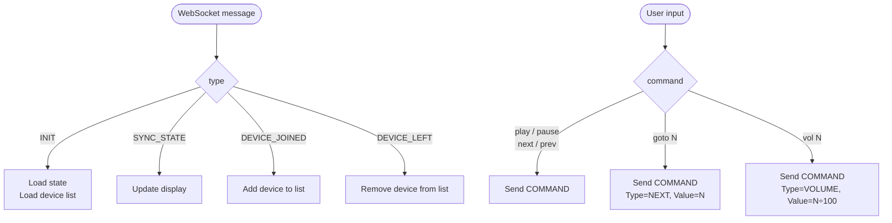

# Go Terminal Client — Reference Client

A terminal UI client for the [Cloud Sync Protocol](cloud-sync-protocol.md), located in [`docs/examples/go-client/`](examples/go-client/). Built with [Bubble Tea](https://github.com/charmbracelet/bubbletea).

This is a reference implementation — any application that speaks the protocol can join the same session alongside Tid3.

---

## What It Does

Connects to the sync server and shows live playback state in the terminal:

- Now playing track, artist, and play/pause status
- Progress bar with current position and duration
- Volume level
- Queue preview (next few tracks)
- List of other connected devices

Also accepts text commands to control the active Tid3 instance.

---

## Setup

### Prerequisites

- [Go](https://go.dev/) 1.21 or later
- A running sync server — see [Cloudflare Worker](cloudflare-worker.md) or bring your own
- Your TIDAL user ID (shown in **Settings → Account** in Tid3)

### Configuration

```bash
cd docs/examples/go-client
cp config.example.json config.json
```

```json
{
  "worker_url": "your-worker.workers.dev",
  "user_id": "YOUR_TIDAL_USER_ID",
  "device_name": "My Terminal"
}
```

| Field         | Description |
|---------------|-------------|
| `worker_url`  | Sync server hostname — no `wss://` prefix, no `/sync` path |
| `user_id`     | Must match the TIDAL account used in Tid3 |
| `device_name` | Label displayed in other clients' device lists |

### Run

```bash
go run .
```

Or build a binary:

```bash
go build -o tid3-sync
./tid3-sync
```

---

## Commands

Type in the input bar at the bottom and press Enter:

| Command        | Description |
|----------------|-------------|
| `play`         | Resume playback |
| `pause`        | Pause playback |
| `next`         | Skip to next track |
| `prev`         | Previous track |
| `goto <index>` | Jump to queue index (e.g. `goto 3`) |
| `vol <0-100>`  | Set volume (e.g. `vol 60`) |

Press `Ctrl+C` or `Esc` to exit.

---

## Protocol Behaviour

The client is a **passive observer** — it reads state but never publishes it. This avoids conflicts with the active playback device and keeps the implementation simple.



Notably, it never sends `UPDATE_STATE`. All playback changes are sent as `COMMAND` messages directed at the active device (with empty `TargetDeviceId` to broadcast).

---

## Dependencies

| Package | Purpose |
|---------|---------|
| [`charmbracelet/bubbletea`](https://github.com/charmbracelet/bubbletea) | Terminal UI framework |
| [`charmbracelet/bubbles`](https://github.com/charmbracelet/bubbles) | Progress bar and text input |
| [`charmbracelet/lipgloss`](https://github.com/charmbracelet/lipgloss) | Terminal styling |
| [`gorilla/websocket`](https://github.com/gorilla/websocket) | WebSocket client |

---

## Building Your Own Client

The Go client is intentionally minimal. To build a client in any language you only need:

1. A WebSocket library
2. JSON serialization
3. The three connection parameters: `userId`, `deviceId`, `deviceName`

For the full message specification see the [Cloud Sync Protocol](cloud-sync-protocol.md).
